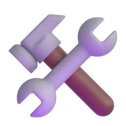
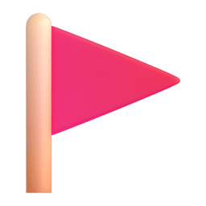

# Hey 👋! My name's <a href='https://www.linkedin.com/in/dev-mirian-quispe/' target='_blank' style='color: #ff6563' >Mirian</a>!

 

## About me 

- 💻 I'm Full-Stack Developer;

- 🔭 I'm currently working as Frontend Developer at Wivenn;

- ✨ I graduated in Full-Stack development at [Cubos Academy](https://github.com/cubos-academy);

- 😍 My personal **<a href='https://mirian-quispe.netlify.app/sobre' target='_blank'>portfolio</a>**;

- 💬 You can ask me about **Typescript, React.JS, Node.JS, Express.JS, SQL**, i will do my best to answer 😁;

- 🚀 I'm currently studying **Angular** 🚀;

- 😎 A little more about me: I'm a huge pet lover 💕, and I have the joy of sharing my life with seven adorable cats 🐈🐈‍⬛. I enjoy watching Anime and Movies 📺, as well as reading books 📚 that transports me to different realities 🌍.

 

##  Tech Stack

 

    
    
    
    
    
    
    
     
    
    
    
    
    
    
    
    
    
    
    
    
 

##  Contact me

##  GitHub Analytics

  
  

---
