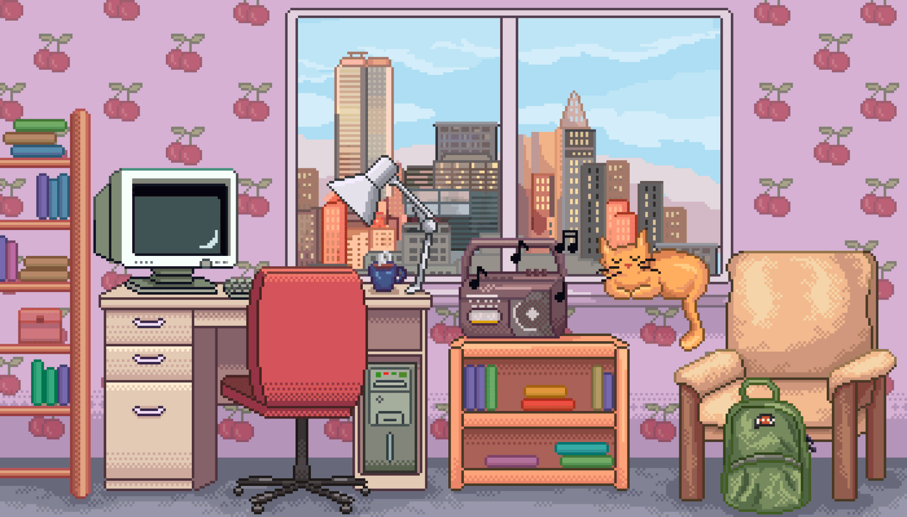

# Hey  ! My name's Mirian!

 

## About me 

- 💻 I'm Junior Full Stack Developer 💻

- 🚀 I'm current study Software Development at Cubos Academy 🚀

- Fun fact: I love pets 💕 and I have 7 cats 🐈🐈‍⬛

---

 

  
  

 

###

  
  
  
  
  
  
  
  
  

 
 

  
  
  
  

###
